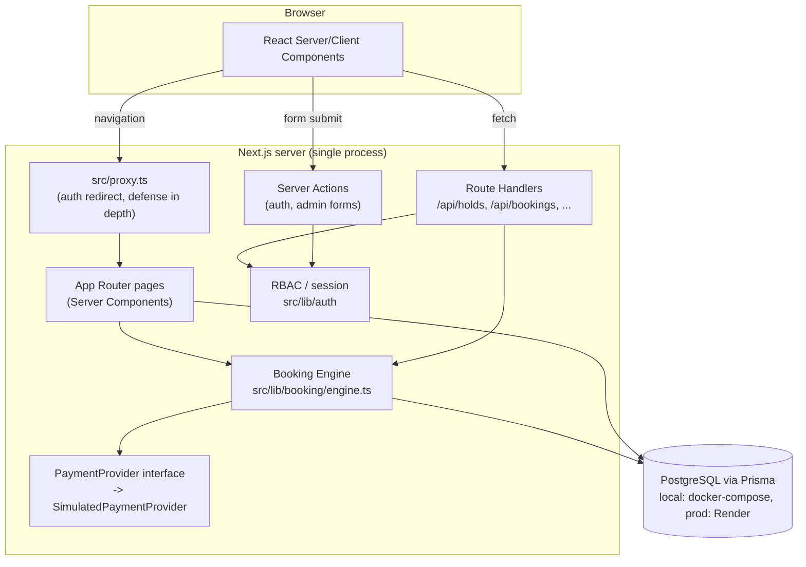

# CineBook Architecture

## Overview

CineBook is a **modular monolith**: a single Next.js 16 (App Router) application
that contains the customer web app, the admin console, and the API/domain
layer, backed by one relational database via Prisma. There is no
microservice split — at this scale it would add operational overhead
(service discovery, network calls, distributed transactions for what is
fundamentally one consistency boundary: seat inventory) without a
corresponding benefit. See [Local-first / production-later](#local-first--production-later)
for how this evolves if the app ever needs to scale beyond one process.

## Layers

| Layer | Location | Responsibility |
|---|---|---|
| Presentation | `src/app/**/page.tsx`, `src/components/` | Server Components fetch data directly via Prisma query helpers (`src/lib/catalog.ts`, `src/lib/booking/queries.ts`); client components handle interactivity (seat map, countdown, forms) |
| Mutation boundary | `src/app/actions/*.ts` (Server Actions), `src/app/api/**/route.ts` (Route Handlers) | The only places allowed to write data. Every one re-validates input with Zod and re-checks auth — never trusts the client |
| Domain / business logic | `src/lib/booking/`, `src/lib/pricing.ts`, `src/lib/payments/` | Seat holds, booking lifecycle, pricing, payment abstraction. Framework-agnostic — no Next.js imports here |
| Data access | `src/lib/prisma.ts`, `prisma/schema.prisma` | Single Prisma client singleton; schema is the source of truth for constraints |
| Cross-cutting | `src/lib/auth/`, `src/lib/errors.ts`, `src/lib/logger.ts`, `src/lib/audit.ts`, `src/lib/rate-limit.ts` | Session/RBAC, structured errors, structured logs, audit trail, local rate limiting |

## Domain boundaries

- **Catalog** (Movie, Genre, Cinema, Screen, Seat, SeatCategory) — read-mostly reference data, written by admins.
- **Scheduling & inventory** (Showtime, ShowtimeSeat) — one `ShowtimeSeat` row per (showtime, seat) is the single source of truth for seat status. See [BOOKING_ENGINE.md](./BOOKING_ENGINE.md).
- **Booking lifecycle** (SeatHold, Booking, BookingItem, Payment, Ticket) — the transactional core; see the same doc.
- **Identity** (User, CinemaStaff, LoginAttempt) — auth and RBAC.
- **Observability** (AuditEvent) — administrative action trail.

## Authentication architecture

Local, self-contained auth (no external IdP, appropriate for a local dev
target): passwords hashed with `bcryptjs` (12 rounds), sessions are signed
JWTs (`jose`, HS256) in an `httpOnly`, `sameSite=lax` cookie — no server-side
session table, so logout only clears the cookie (a stolen token remains
valid until it expires; see [SECURITY.md](./SECURITY.md) for the
production mitigation). `src/proxy.ts` (Next 16's renamed `middleware.ts`)
redirects unauthenticated/unauthorized page loads as a UX convenience only;
the actual authorization boundary is re-checked in every Server Action,
Route Handler, and page via `src/lib/auth/rbac.ts` (`requireUser`,
`requireRole`, `requireStaff`, `requireAdmin`, `assertOwnsResourceOrStaff`).

## Authorization model (RBAC)

Four roles: `CUSTOMER`, `STAFF`, `CINEMA_MANAGER`, `ADMIN`.

- Customers may only ever read/cancel their **own** bookings/tickets —
  enforced by `assertOwnsResourceOrStaff` (an explicit IDOR guard), not by
  hiding UI controls.
- `STAFF` / `CINEMA_MANAGER` / `ADMIN` may reach `/admin/*`.
- **Known simplification**: `CinemaStaff` (a manager-to-cinema assignment
  table) exists in the schema for future per-cinema scoping, but the
  current admin screens do not yet filter by it — any STAFF/CINEMA_MANAGER
  account can see all cinemas' showtimes/bookings, only `ADMIN` is
  distinguished further (e.g. the audit log is ADMIN-only). Documented
  here rather than silently shipped as if it were fully scoped.

## Booking lifecycle

See [BOOKING_ENGINE.md](./BOOKING_ENGINE.md) for the full state machine,
the concurrency-safety mechanism, and payment idempotency.

## Pricing

Server-authoritative, computed in `src/lib/pricing.ts` +
`src/lib/booking/engine.ts` from the showtime's `basePriceCents` and the
seat's `SeatCategory.priceMultiplier`. The client-side seat map calls
`GET /api/showtimes/:id/seats`, which returns per-seat prices computed the
same way — for display only. The authoritative computation happens again,
server-side, when a booking is created from a hold
(`createBookingFromHold`), and the result (`subtotalCents`, `feesCents`,
`taxCents`, `discountCents`, `totalCents`) is stored on `Booking` as an
immutable snapshot, so a later change to `BOOKING_FEE_CENTS`/`TAX_RATE`
never rewrites history.

## Error handling model

Every domain error is an `AppError` (`src/lib/errors.ts`) with one of a
fixed set of codes (`SEAT_UNAVAILABLE`, `SEAT_HOLD_EXPIRED`,
`SHOWTIME_NOT_AVAILABLE`, `INVALID_BOOKING`, `PAYMENT_FAILED`,
`UNAUTHORIZED`, `FORBIDDEN`, `VALIDATION_ERROR`, `NOT_FOUND`,
`RATE_LIMITED`, `CONFLICT`, `INTERNAL_ERROR`), each mapped to an HTTP
status. `src/lib/api-helpers.ts`'s `apiHandler` wraps every Route Handler
so any other thrown error becomes `INTERNAL_ERROR` with a generic message —
the real error is logged server-side only, never sent to the client. The
root `src/app/error.tsx` boundary does the equivalent for uncaught render
errors: it logs to the console and shows a generic "Something went wrong",
never `error.message` or a stack trace.

## Observability

Structured JSON logs (`src/lib/logger.ts`) for a fixed set of named events
(`AUTH_LOGIN_SUCCESS`, `SEAT_HOLD_CREATED`, `BOOKING_CONFIRMED`,
`PAYMENT_FAILED`, `ADMIN_ACTION`, etc. — see the file for the full list).
Administrative actions are additionally persisted to the `AuditEvent`
table (`src/lib/audit.ts`) and viewable at `/admin/audit` (ADMIN only).
No passwords, tokens, or full payment details are ever logged.

## Test architecture

See [TESTING.md](./TESTING.md).

## Configuration strategy

All environment variables are parsed and validated once, at import time, by
`src/lib/config.ts` (Zod schema) — every consumer imports typed config from
there, never reads `process.env` directly. `config.ts` is marked
`import "server-only"` so an accidental import from a client component is a
build-time error rather than a browser runtime crash (this exact mistake
happened once during development — `src/lib/pricing.ts` used to import it
transitively; see its module comment and the git history for the fix).

## Local-first / production-later

| Local (today) | Production migration path |
|---|---|
| Local Postgres (`docker-compose.yml`) | Render's managed Postgres in production — same `provider = "postgresql"` schema, just a different `DATABASE_URL` (see [DEPLOYMENT.md](./DEPLOYMENT.md)). No schema changes needed between the two |
| `SimulatedPaymentProvider` (`src/lib/payments/`) | Implement `PaymentProvider` (e.g. `StripePaymentProvider`) and swap the export in `src/lib/payments/simulated-provider.ts` — the booking engine never imports the concrete provider |
| In-process seat-hold expiry (lazy sweep on read/write, see BOOKING_ENGINE.md) | Move to a scheduled worker + Redis/DB-backed lock if running >1 app instance |
| In-memory rate limiter (`src/lib/rate-limit.ts`) | Redis-backed (e.g. `@upstash/ratelimit`) so limits are shared across instances |
| Local console/JSON logs | Ship to a centralized log sink (Datadog, CloudWatch, etc.) |
| Local SVG poster/backdrop placeholders (`public/`) | Object storage (S3/R2) + a real CDN/image pipeline |
| JWT cookie sessions, no revocation list | Add a server-side session/refresh-token store for immediate revocation on logout across devices |
